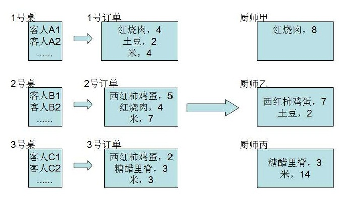
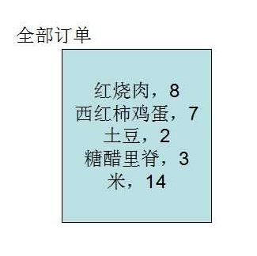
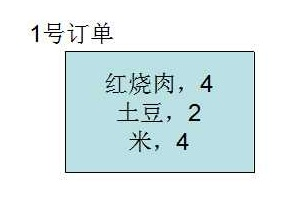
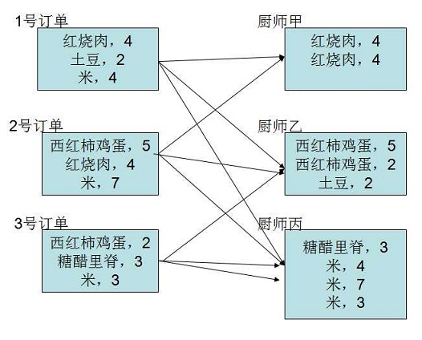
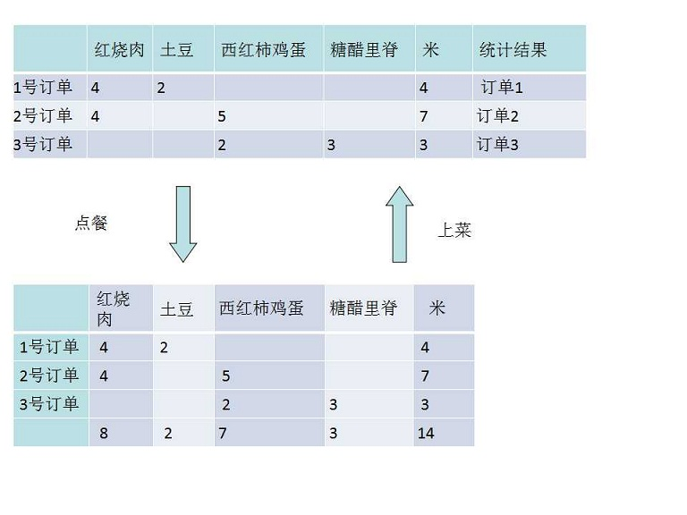

## 引言

  以往也看过一些对于MapReduce框架的通俗解释，例如

* [Hadoop的MapReduce实现原理解释](http://blog.csdn.net/fullofwindandsnow/article/details/7258667)
* [我是如何向老婆解释MapReduce的？](http://blog.jobbole.com/1321/)

但是，总是感觉这些例子比较生硬。这些例子都需要自己有分布式的意识，而不是说这本身就是分布式在执行了。前几天，我在快餐店慢悠悠吃着饭，看着好多饭菜都整齐的摞在一起，服务员熟练的按照订单把各种饭菜打包成一个外卖。我猛然发现，我好像明白了Shuffle的本质。

## 第一部分：点餐与并行

  让我们来想象一下，在一个熙熙攘攘的小餐馆有很多的顾客。一个服务员热情的招待着一桌的顾客。服务员依次问每个客户需要什么。西红柿炒蛋，红烧肉人人都爱。然后服务员把每桌订单交给厨房。每个大厨统计一下自己需要烹饪哪些菜，每个菜的数量是多少，然后把自己负责的菜都烧好。在多个大厨的精心烹饪下，服务员快速按照订单分拣，一桌美味很快出炉。当然这些美味也很快就消失在人们欢乐的笑声中。

  这种熟悉的场景，很自然的蕴含了分布式在里面。比如说，多个服务员同时可以招待很多客人，多个大厨同时做不同的菜。这个确实没有什么奇怪，如果不这样做反而奇怪。

## 第二部分：点餐和MapReduce

|           餐馆                     |         处理数据                   |
|------------------------------------|------------------------------------|
| 如果很多的顾客在小餐馆             | 我们需要处理的数据                 |
| 一个顾客                           | 一条数据KV对                       |
| 客人是按照桌子分开坐               | 把数据分成多块，每块称为split      |
| 一个服务员                         | 一个mapper                         |
| 一个服务员招待一桌客人             | 每个mapper处理一个split            |
| 服务员依次询问每个客人需什么       | mapper对于每个KV执行map函数        |
| 一个完整的订单                     | mapper处理之后的结果               |

  mapper是一个执行的实体，就像是一个服务员。它的作用就是处理只和一条数据相关的操作，执行映射操作:y=map(x)。比如说，有一个以前在这里吃过霸王餐的人来了，那么服务员只需要一看到他，就知道这家伙不好对付。具体到文本处理的话，有过滤，提取，拆分等。如果我要根据正则来过滤文本，那么只需要判断这一行符不符合正则表达即可。如果我要提取csv文件中的一行，那么只需要把每行按照','分割后，提取相应的字段即可。如果我要拆分一行，用于统计单词的个数，那么只需要把一行按照' '分割后，多次写到输出就可以了，一行的数据，变成了多行。

  之所以把mapper成为一个框架，是因为只要你提供如何处理一条数据map函数。至于不断获取一条数据，使用该函数处理一条数据，输出该条数据的结果，继续下一次循环等琐碎的细节是不需要你管理的，框架已经帮你完成了。

  总结来说，mapper使用自定义的map来处理每个KV。所以map的输入参数就是一个KV，它里面写的就是只和一个KV有关的操作，除此之外它没有办法获得任何其他信息。换句话说，map函数只需要一个KV，所以map实现并行非常简单的。

  map的处理只和一个KV有关，也就意味着如果输出和多个KV有关的话，那么map就是无能为力了。比如说，餐馆中一共有多少客人，这显然不是和一个客人有关。一个文本有多少多少行，显然也不是只和一行有关。这个时候，就需要其他的办法了，其实就是下面的介绍的combine和reduce。

  当然，在分别询问了每个人的点餐之后，还有需要注意的地方，就是你肯定不会拿到像下面这样的订单，每个菜色没有汇总。

  当然也不会是这样，直接就是全部的所有人的汇总订单

  每桌的订单，应该是经过简单汇总的

  上面说过map只和一个KV有关，那么如何完成上述的和多个KV有关的合并操作呢？在这里就是combine。combine和reduce的不同之处在于，combine拥有的的只是每个mapper处理完成之后的数据，而reduce则是处理所有相关的数据。就是说，这里的订单仅仅是这一桌客人点的菜进行了一些简单的汇总，而不是所有顾客订单的汇总。

  顾客的订单被服务员收集上来，但是呢，大厨之间的分工明确，每个大厨负责几个菜色。相同的菜如果有两个大厨做，容易有很多问题，所以还是分工明确比较好。菜色和数量在订单上是按照桌子排列的，菜色在大厨则是按照类别分的。把每桌订单上的某类菜的数量告诉相应的大厨，这是一个相当混乱的过程。相当于是下面的这个样子。

  这个就是shuffle的过程。shuffle就是这么一个把数据按照一个新的顺序排列的过程。但是再此之前，如何确定哪类菜的数量到底应该告诉哪个大厨呢？每个大厨并不是只做一种菜（真这样的话，小餐馆可以关门了），而是同一个大厨要做好多种菜，那么，我们需要根据菜色,得到做这种菜的大厨，然后把菜色和对应的数量告诉他。

|           餐馆                     |         处理数据                   |
|------------------------------------|------------------------------------|
| 菜色                               | mapper输出的Key                    |
| 大厨名字                           | partition                          |
| 菜色和大厨名字对应关系             | Partitioner                        |
| 一个大厨对应多个菜色               | 一个partition对应多个Key           |
| 一个大厨对应一个名字               | 一个partition对应一个reducer       |
| 一个大厨                           | 一个reducer                        |
| 一个菜色有很多不同的订单           | 同样Key相应的很多Value             |
| 每种菜色统计个数                   | 调用reduce函数                     |

  Partition就相当于是reducer的名字，而Partitioner则是负责分配数据到哪个reducer上去执行。这个分配的工作就很重要了。一般来讲，总有那么几个菜色深受大家喜爱，分配的不合理的话，有的大厨一直忙忙碌碌，有的大厨则是闲着无聊。如果Partitioner选择不合理，那么就会使一些reducer负担过重，其他人都干完了，就它几个没有干完，严重拖延了运行效率。合理地自定义Partitioner，尽可能的让每个reducer处理的数据均衡还是很重要的。

  reducer也是一个执行的实体，类似于一个大厨。就像每个大厨负责很多个菜色，他获得的是每种菜在每个订单的个数，他需要统计出每种菜，对应的总数。类似的，每个reducer获得的是每个Key在在每个mapper上输出的结果，它需要使用reduce函数把相同Key的不同mapper的输出统计在一起。之所以把reducer称为编程框架，是因为你需要提供如何处理一个Key和对应的全部Value。至于不断获取一个Key，调用reduce函数处理对应的Value，输出该条Key的结果，继续循环等琐碎的细节是不需要你管理的。

  reducer使用reduce处理每个Key和相应的全部Value。也就是说，每个reduce处理的是一个Key和相应的全部Value，那么不同的Key就可以并行处理。就像上面大厨同时炒不同的菜色。注意，同一个菜色不同的大厨做，虽然也是并行，但是容易有很多问题。reduce操作是和同一个Key的多个Value相关的操作。什么叫做和多个Value相关呢。比如之前我们统计每种菜色的个数，这个要看所有订单上该菜色的数据。具体到文本处理的话，那么就是说经典的WordCount,统计文件中行数，去重等等。

  这里再次提示reduce和combine的区别，combine拥有的的只是每个mapper处理完成之后的数据，而reduce则是处理所有相关的数据。这里面其实蕴含着特别大的区别。有无combine，最终数据的输出结果应该是相同的。也就是，该函数分别处理一部分数据，然后把中间结果再合并起来，最后的输出结果是相同的，函数符合结合律。而且combie的输入和输出类型应该和map输出类型一致，否则会出现错误。
  在shuffle前和shuffle后都会有combine，但是只有在shuffle后才有reduce。reduce的输入需要和map的输出类型一致，reduce的输出和map的类型没有关系。shuffle前的combine可以减少网络IO。类似于reduce，combine也是可以自定义的。

  忙活了这么多，大厨总算是开始去炒菜了。以上的过程也是一个标准的WordCount的过程的完整介绍，还顺带介绍了split,combine,shuffle,partition等重要的概念。但是呢，我们的讨论并没有到此为止。顾客们还没有吃上菜呢。

## 第三部分：深究mapreduce
  多个大厨们精心烹饪，各种美味菜色新鲜出炉，服务员按照之前的订单组合各种美味。这是我引言中提到的一个场景。那么根据订单组合菜色，算是shuffle吗。是的，shuffle是数据从一个维度的聚合变成另外一个维度的聚合。

  订单的统计是一次MapReduce的过程，而把做好的饭菜按照订单打包不过是另一个shuffle的过程。很多饭菜流水线式的生产出来，服务员把饭菜按照订单分拣，就是一次完美的shuffle过程。如果认真思考整个做饭的过程，这个是先把各种蔬菜reduce成一个一个不同种类的菜的过程，然后按照订单分拣是一次shuffle，最后把饭菜送出去就是一个简单的map过程。和前面的订单统计完全反转的一个过程。

  正像图中那样，订单是一个维度，菜色是另一个维度。我们把订单按照菜色统计，这是shuffle，把完成的饭菜按照订单聚合这也是shuffle。

  考虑很多饭菜都是按照菜色聚合在一起，把它们按照菜单聚合在一起将是一个很复杂的混乱过程。搬移这些饭菜将是很浩大的工程。就像是很多数据存在不同的机器上，现在我们要把他们按照Key进行聚合，需要大量的通过网络传输数据，大量的数据就会不断的交换。如果能够尽可能的让数据留在本地，不需要通过网络传输，可以极大的提高shuffle的性能。如何由于订单之间都是相互独立的。所以多个服务员可以同时分拣，并行执行。shuffle阶段，一个reducer可以同时向多个mapper要数据，当然，一个mapper可以同时像多个reducer传输数据，这是一个很复杂的连接。

* 那么mapreduce本质上来讲就是为了把由文件行数来度量的变成需要的度量维度。
* map的输入KV中的Key不过是以前维度的度量，一般这个Key没有什么价值
* map的输出KV中的Key则是新维度的
* shuffle可以将新维度相同属性的KV进行汇聚在一块
* reduce则是负责将相同属性的V进行合并

## 第四部分：问题

  如果看完本文不能回答以下问题，说明写的还不够好，希望多提意见

 * 整个MapReduce包括那几部分 ？
 * MapReduce框架由哪几部分是可以自定义的 ？
 * map只和一个KV有关，这话是什么意思 ？
 * reduce和一个k的多个v有关，这话是什么意思 ？
 * combine和reduce的区别 ？
 * map为什么能并行处理 ？
 * reduc为什么能并行处理 ？
 * shuffle是数据从一个维度的聚合变成另外一个维度的聚合，这话什么意思 ？ 什么叫做一个维度，另一维度？
 * shuffle的数据来源，数据目的地，瓶颈都是什么？
