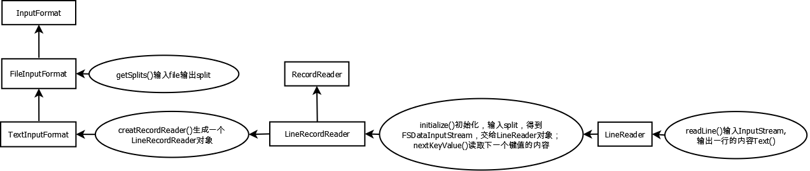

#Map的输入：以TextInputFormat为例
***
这里解答第一个问题，文本怎么变成(K,V)的。
一个大体的流程就是:

* 首先把一个文件按照大小均分成几个Split，每个Split交给一个MapTask去处理。
 * 那么什么是Split？按照大小划分的Split是不是太随意了?如何处理这个Split呢？Split和单个文件内容上有什么关系，使用上有什么区别？
* 以TextInputFormat为例，每个Split被最终变成了一些(K,V)，每个(K,V)代表一行，K是该行开始在文件中第几个字节，V是该行的内容。
 * Split怎么变成(K,V)的？Split是直接按照大小分的，而每行则是按照'\n'来划分的，这两者之间的分界线一般情况下都是不同的，那么横跨两个Split的一行，交给那个MapTask处理？

***
###类之间的关系以及功能
***



* 使用TextInputFormat为例。
* InputFormat就是一个抽象的基类。
* FileInputFormat实现了一个重要的方法getSplits()。getSplits()将一个文件均分成不同的Split。
* 而TextInputFormat则仅仅是使用createRecordReader创建了一个对象，该对象是负责把Split变成生成(K,V)的。具体实现在LineRecordReader类
* 首先看一下LineRecordReader中使用的一个辅助类LineReader
* LineReader的作用就是从一个文件流中读取一行，至于这些数据如何变成(K,V)的和这个类是没有关系的。
* LineRecordReader中的nextKeyValue()通过LineReader获取一行数据，字节偏移作为K，读入数据作为V，封装为(K,V)，并且提供了getCurrentKey()获取K的值，getCurrentValue()获取V的值。
* LineRecordReader通过initialize()和nextKeyValue()的组合来处理行的边界和Split的边界不一致的问题

***
###FileInputFormat
***
* Split是什么呢？如果说你有一个西瓜，几个人一起吃，那么肯定要切开才能吃。

```java
来自org.apache.hadoop.mapreduce.lib.input.FileInputFormat
public FileSplit(Path file, long start, long length, String[] hosts) {
    this.file = file;
    this.start = start;
    this.length = length;
    this.hosts = hosts;
}
```
* 从Split的构造函数可以看出来，这里只是记录了一些每个Split对应的开始和范围，所有的Split还是一个文件。
* 本质上就是均分了一个文件成几个独立得块。(划分是由HDFS完成的)
* 就像切西瓜一样，每个MapTask分到了一个Split

***
###TextIputFormat
***

```java
来自org.apache.hadoop.mapreduce.lib.input.TextInputFormat
 public RecordReader<LongWritable, Text> 
    createRecordReader(InputSplit split,
                       TaskAttemptContext context) {
    return new LineRecordReader();
  }
  protected boolean isSplitable(JobContext context, Path file) {
    CompressionCodec codec = 
      new CompressionCodecFactory(context.getConfiguration()).getCodec(file);
    return codec == null;
  }
```
* createRecordReader就是创建了一个新的LineRecordReader对象。
* 这种设计方式，使得实现一个自己的RecordReader非常方便。
* isSplitable说明是否可以Split，毕竟有的是不可以分割的，比如压缩文件。
* 这个类的主要目的就是实现这么一个通用的接口，可以非常方便的读取各种格式的文件。

#####LineReader

该类实现了从一个流中读出一行来，具体实现在readLine方法中

* LineReader的作用就是从一个文件流中读取一行，就是方法readLine()。这里呢，不对输入做任何的假设，就是当作一个完整的文件读取出一行。
* readLine()不对输入做任何的假设，就是当作一个完整的文件读取出一行。
* 重点问题在于行的分界符是不同的，'\n'是Unix风格，'\r\n'是Windows风格，'\r'是MacOS风格。

#####LineRecordReader
该类有两个重要功能

* 把数据封装成(K,V)
* 处理Split的边界和行的边界不一致的问题

######封装成KV
```java
来自org.apache.hadoop.mapreduce.lib.input.LineRecordReader
    nextKeyValue()部分代码{
        key.set(pos);
        newSize = in.readLine(value, maxLineLength,
                                  Math.max((int)Math.min(Integer.MAX_VALUE, end-pos),
                                  maxLineLength));
    }
    public LongWritable getCurrentKey() {
        return key;
    }

    public Text getCurrentValue() {
        return value;
    }
```
* 这几个方法完成了把数据封装成(K,V)形式
* LineRecordReader中的nextKeyValue()通过LineReader获取一行数据，字节偏移作为K，读入数据作为V，封装为(K,V)，并且提供了getCurrentKey()获取K的值，getCurrentValue()获取V的值。
* 上面的代码只是nextKeyValue中赋值的两句，可以看出来，K是第几个字节数，V是读入的行的内容
* getCurrentKey()或者getCurrentValue()直接看代码吧。

######处理边界不一致的问题

```
initialize()部分代码
if (skipFirstLine) {  // skip first line and re-establish "start".
  istart += in.readLine(new Text(), 0,
  (int)Math.min((long)Integer.MAX_VALUE, end - start));
}
```

```
nextKeyValue()部分代码
while (pos < end) {
      newSize = in.readLine(value, maxLineLength,
                            Math.max((int)Math.min(Integer.MAX_VALUE, end-pos),
                            maxLineLength));
      if (newSize == 0) {
          break;
      }
      pos += newSize;
      if (newSize < maxLineLength) {
          break;
      }
}
```

* 通过initialize()和nextKeyValue()的组合来处理行的边界和Split的边界不一致的问题
* nextKeyValue()读取的停止条件可以看出，每次都是读取完整的一行的，即使是超过了Split的边界(其实这个边界就是相当于是一个约定而已，可以做稍微的调整)。
* 假设有邻近的两块，那么第二块的开头已经被读过了，那么怎么保证不重复读取呢？读取第二块时，默认开头已经读取过了，跳过第一个'\n'之前的内容。
* 但是如果是第一块呢，没有读取过那么就不跳。结果就是initialize()中的判断是否跳过第一个'\n'之前的内容。
* 注意，每个Split中第一个'\n'之前的内容和横跨两个Split的一行的内容，这两者的含义是不同，
 * 第一个Split中的'\n'的之前的内容是完整得一行。
 * 但是后面得其他Split中的'\n'的之前的内容是可能就不是完整的一行,一部分在前一Split的末尾，一部分在当前Split的开头.
* initialize()和getKeyValue()对不同MapTask处理的内容做了微微调整，基本上保证了每个Split由一个MapTask处理的语义。

***
###实现自己的InputFormat
***
* 如果你不需要实现自己的Split，仅仅是想读取自定义的文件格式，那么只需要实现一个RecordReader类，并且createRecordReader中返回该类的RecordReader对象。比如说，每100字节作为一个(K,V)之类的。

***
###总结
***
* 对于外部的调用而言，他不需要考虑内部是如何实现将文本(或者是其他的文件格式)转换成(K,V)的，他只需要通过
 * initialize()来实现初始化
 * nextKeyValue()就可以判断是否还有可以使用的(K,V)
 * getCurrentKey()获取当前的Key值
 * getCurrentValue()获取当前的Value值
* 至于内部是Split如何切割，如何读取一行是和他没有关系的
 * 内部实现保证每个Split由一个MapTask处理的语义
 * 内部实现保证每个(K,V)的语义
* 那么这些方法具体是怎么使用的呢？请看下一部分对MapTask的介绍
