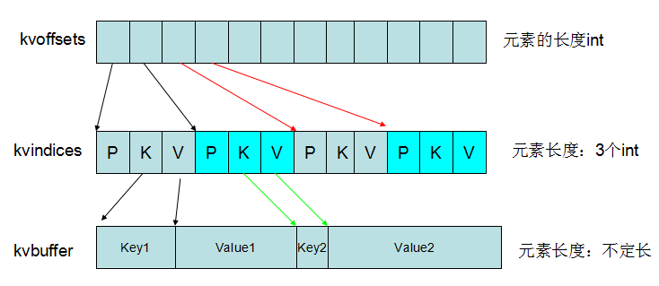
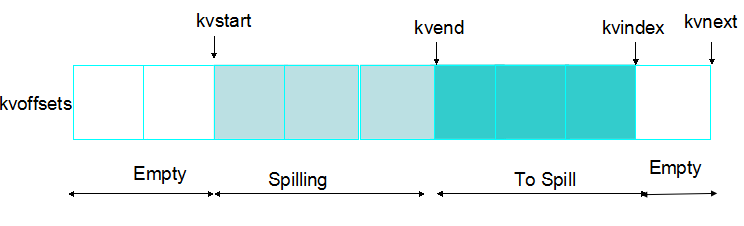
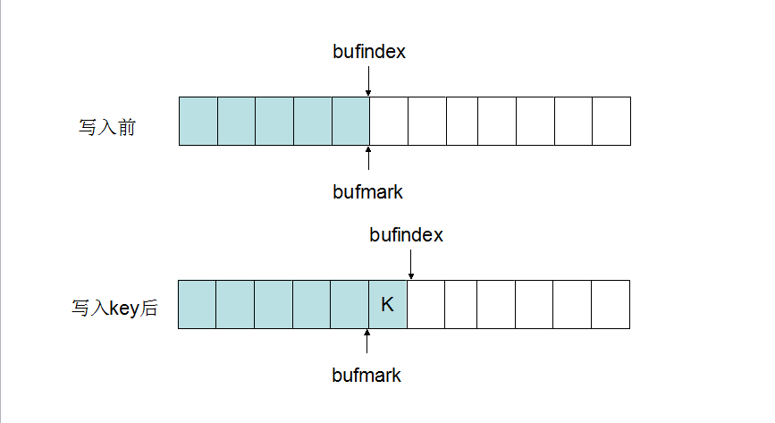
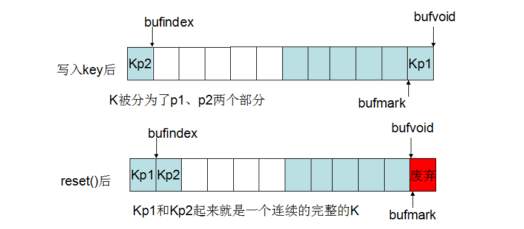

#MapOutputBuffer分析

* MapOutputBuffer中包含有一个缓冲区和相应的操作（包含的内容非常多）
 * 下面将详细介绍的缓冲区
 * 对缓冲区读取的方法
 * 对缓冲区写入的方法
 * 对缓冲区Spill到硬盘的方法（在上一篇文章中介绍过,这里不再赘述）
 * 将Spill文件合并成一个的MergeParts过程也在这里（之后会详细介绍，这里不再赘述）

***
###整体看MapOutputBuffer存储结构
***


* 环形:kvnetx=(kvindex+1)%kvoffsets.length
* 这是一个两级索引(kvoffsets和kvindices)的环形缓冲区。
* 这个是看缓冲区不同层次之间的关系，那么每层又是如何使用的呢？

***
###使用kvoffsets将缓冲区划分成几个部分
***



* 分成了几个部分，空闲、正在Spill、将要Spill。
* 这样同一个缓冲区，可以安全的由多个线程来同时操作。
* 当然kvoffsets和kvindices仅仅是写入了索引，实际的内容是在kvbuffer中的。
* 至于为什么会有二级索引，下面会有分析。

***
###kvbuffer的使用
***

####写入kvbuffer的一般过程（四个步骤）




####写入kvbuffer的异常情况

* 排序时要求key是连续存放的，所以在写入Key之后，要检测是否连续，不连续就要进行相应的操作来保证连续。
* reset()就是用来保证key是连续的。 



***
###关于缓冲区的设计
***

* 这里需要满足的两个目标是存储不定长的数据和对这些数据排序
* 对于不定长的数据来讲，一般的存储方法就是使用索引(起始位置,长度)
* 就是说(startOfPartition,lengthOfPartition,startOfKey,lengthOfKey,startOfValue,lengthOfValue)
* 如果排序的话，将这个作为单位来移动。
* MapOutputBuffer实现的索引是kvindices，具体的值存储在kvbuffer中。
* 但是kvindices没有长度，只有起始位置，那么如何读取数据呢？

####Key的读取

```java
      public DataInputBuffer getKey() throws IOException {
        final int kvoff = kvoffsets[current % kvoffsets.length];
        keybuf.reset(kvbuffer, kvindices[kvoff + KEYSTART],
                     kvindices[kvoff + VALSTART] - kvindices[kvoff + KEYSTART]);
        return keybuf;
      }
```
* KV是连续存放在一起的。
* K本身的连续性在写入的时候已经保证
* 那么V的起始地址和K的起始地址之间就是key的值。

####Value的读取

```java
    public DataInputBuffer getValue() throws IOException {
      getVBytesForOffset(kvoffsets[current % kvoffsets.length], vbytes);
      return vbytes;
    }
    private void getVBytesForOffset(int kvoff, InMemValBytes vbytes) {
      final int nextindex = (kvoff / ACCTSIZE ==
                            (kvend - 1 + kvoffsets.length) % kvoffsets.length)
        ? bufend
        : kvindices[(kvoff + ACCTSIZE + KEYSTART) % kvindices.length];
      int vallen = (nextindex >= kvindices[kvoff + VALSTART])
        ? nextindex - kvindices[kvoff + VALSTART]
        : (bufvoid - kvindices[kvoff + VALSTART]) + nextindex;
      vbytes.reset(kvbuffer, kvindices[kvoff + VALSTART], vallen);
    }
```
* KV是连续存放在一起的，那么就是KVKVKVKV这个样子的
* 就是说V的起始地址和下一个K的起始地址之间的数据就是V的值
* 但是缓冲区是环形的，所以V可能不是连续存放的
* InMemValBytes 这个类就是为了解决不连续这个问题存在的。

####分析
* 这个实现的优点就是可以不再存储KV的长度。
* 缺点呢，不是很明显。这种方法暗含着一个假设，就是索引的位置顺序和存储数据的位置顺序是一致的，
* 也就是说kvindices第一个索引，对应于kvbuffer第一个KV，
* kvindices第二个索引，对应于kvbuffer第二个KV。
* 由此产生的后果就是不可以对索引kvindices排序。
* 一旦对索引kvindices排序，那么key的值仍然是可以正确读出的，但是value的值的读取依赖于下一个索引中key的起始地址（排序之后，下一个就和写入的时候的不一样了），则不能正确读取。
* 那么再建立一层索引kvoffsets，来进行排序。
* 就是说kvindices和kvbuffer实现的缓冲区可以实现存储，但是几乎不可能排序。
* kvoffsets就是为了可以实现排序而引入的

***
###如何使用缓冲区
***

####写入缓冲区数据
* 上面仅仅是解释了如何写入，但是代码中实际上是怎么写的呢？

#####collect中对象的初始化

```
    private final BlockingBuffer bb = new BlockingBuffer();
    keySerializer = serializationFactory.getSerializer(keyClass);
    keySerializer.open(bb);
    valSerializer = serializationFactory.getSerializer(valClass);
    valSerializer.open(bb);

```
#####第一部分:获得序列化的对象

* 默认的是org.apache.hadoop.io.serializer.WritableSerialization

```java
    public SerializationFactory(Configuration conf) {
        super(conf);
        for (String serializerName : conf.getStrings("io.serializations", 
            new String[]{"org.apache.hadoop.io.serializer.WritableSerialization"})) {
                add(conf, serializerName);
            }
        }
    默认Serialization中返回的WritableSerializer
    public Serializer<Writable> getSerializer(Class<Writable> c) {
        return new WritableSerializer();
    }
```
#####第二部分:open方法

```java
WritableSerializer中open方法的实现

    public void open(OutputStream out) {
        if (out instanceof DataOutputStream) {
           dataOut = (DataOutputStream) out;
        } else {
           dataOut = new DataOutputStream(out);
        }
   }

调用该函数时的参数是：
private final BlockingBuffer bb = new BlockingBuffer();
```
#####collect写入过程
```
    keySerializer.serialize(key);
    valSerializer.serialize(value);
```

* 看这个可能感觉比较奇怪，为什么这样就直接写入了缓冲区呢？

```java
WritableSerializer中serialize实现
    public void serialize(Writable w) throws IOException {
        w.write(dataOut);
    }
```
* 就是写入了刚才打开的BlockingBuffer中
* BlockingBuffer 中实际起作用的是Buffer类
* Buffer类中write方法，实现了之前说的各种写入时的管理策略。

####从缓冲区读入数据

* 从缓冲区读取出有两种方法
 * 一种方法是sortAndSpill方法中使用的直接从内部的数组读取（spillThread是写在MapOutputBuffer的一个内部类）
 * 还有一种方法是MRResultIterator，这个类将缓冲区内的数据封装成KV对的读取由combiner使用的。
