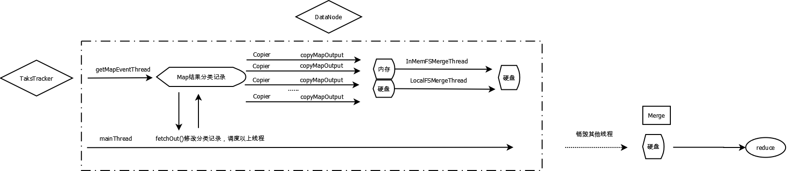
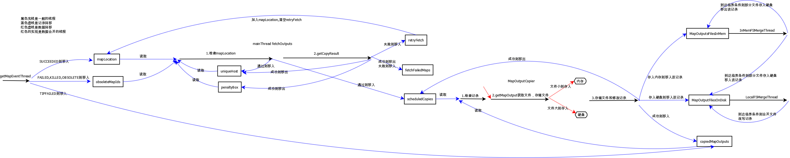
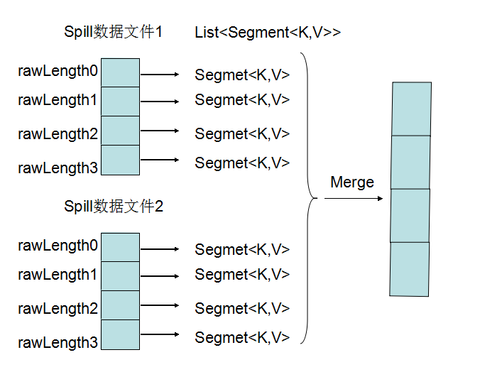
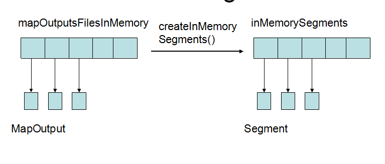

#Copy Phase
***

###概述COPY Phase
***

这个是获取map结果输出的过程，然后交给reduce去处理。

主要是包括以下几个方面

* fetchOutputs
* GetMapEventThread
* MapOutputCopier
* InMemFSMergeThread 
* LocalFSMerger

***
###几个方面之间的关系
***


* fetchOutputs
 * 由mainThread使用，主要是负责管理整个获取数据的流程
 * 开始时启动其他几个线程，完成后释放各种资源
 * 将已经获取数据的记录删除，添加新的已经完成的MapTask
* GetMapEventThread
 * 从TaksTracker获取MapTask的完成情况，将完成的添加到自己的记录中
* MapOutputCopier
 * 根据各种Map结果的记录，来获取数据
 * 小的文件保存在内存中，大文件保存在硬盘中
* InMemFSMergeThread 
 * 将内存中的数据写入硬盘中，减小内存占用
* LocalFSMerger
 * 文件较多的时候，将硬盘中的文件merge，减少文件个数

***
###map结果的分类记录实际关系
***

map结果分类记录和各个线程之间的关系还是很复杂的。



***
###分析每个部分
***
#####fetchOutputs
#####GetMapEventThread
```
    public void run() {        
        do {
            int numNewMaps = getMapCompletionEvents();       
            Thread.sleep(SLEEP_TIME);
        } while (!exitGetMapEvents);
    }
    private int getMapCompletionEvents() throws IOException {
        //获得更新的MapTask完成的信息
        // Process the TaskCompletionEvents:
        // 1. 将SUCCEEDED的maps存入knownOutputs，之后从这里面获取数据
        // 2. 将OBSOLETE/FAILED/KILLED的maps存入obsoleteOutputs，之后停止重这些地方获取数据
        // 3. 将TIPFAILED的maps从neededOutputs移除，因为根本不需要这些数据
   }
```
#####MapOutputCopier

* 使用copyOutput方法来从其他机器上将数据复制过来
 * 根据一些记录来调用getMapOutput将文件复制过来
 * getMapOutput方法是负责将一个文件复制过来的方法
 * getMapOutput方法中使用setupSecureConnection来建立连接
 * 如果文件比较小，就放在内存中shuffleInMemory
 * 否则放入硬盘中shuffleToDisk
* 存入内存的文件由mapOutputsFilesInMemory索引
 * ShuffleRamManager负责管理内存，就是简单的记录内存的大小
 * MapOutput为实际上每个内存中文件的存储对象
* 存入硬盘的文件由mapOutputFilesOnDisk索引

#####LocalFSMerger


* 这里和Map端合并溢写文件基本类似
* 这个就是普通的merge过程
* 之后会有对Merger的详细分析

#####InMemFSMergeThread


* 图中就是如何将内存中存储的文件(MapOutput对象)变成Segment对象
* ShuffleRamManager中的waitForDataToMerge决定了Merge的条件
* 一共由四个
* 执行Merge的过程doInMemMerge
 * createInMemorySegments,将内存封装成很多个Segments
 * 可能有combine
 * 写入硬盘的文件由mapOutputFilesOnDisk索引
 * 写入使用IFile.Writer
* 之后由对Merger的详细分析
