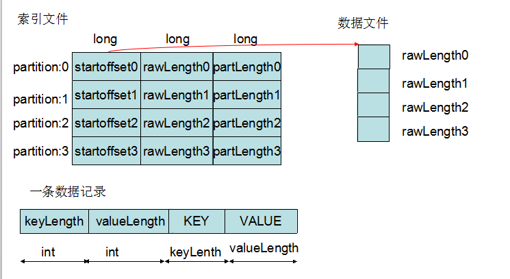

#Merge
***
###概述
***
###Merger Class
* Merger Class指使用的这个类
* Merger.merge是将多个文件中的不同部分封装已经排序的Iterator
* Merger.writeFile是写入文件
* Merge一般是对指文件进行操作
 * Merge操作是将多个文件合并并且保存排序性质
 * 排序是先按照Partition排序，再按照Key排序
* 如果要保持排序性质，那么就要根据Partition来读取文件
 * 先把所有文件中Partition为0的部分取出来，根据Key排序后，写入文件
 * 然后所有文件中Partition为1的部分取出来，根据Key排序后，写入文件
 * ...
* 如何进行封装来屏蔽文件来源的复杂性？请看Segment小节
* 如何对数据再次进行排序？请看MergeQueue小节

###IFile
* Merge和IFile类紧密的联系在一起
* 从map处理过的数据Spill到硬盘上的使用IFile.Writer来写入的
* 直到reduce的读入，硬盘中的文件也是使用的IFile.Reader
* 在这之中读写硬盘，都是使用的IFile.Reader或者是IFile.Writer
* IFile在硬盘中的存储格式就是像下面这样


#####索引文件和IndexRecord
```java
IndexRecord中的结构
  long startOffset;
  long rawLength;
  long partLength;
```

#####每条记录的结构
```
IFile中Writer的append方法：

   WritableUtils.writeVInt(out, keyLength);                  // key length
   WritableUtils.writeVInt(out, valueLength);                // value length
   out.write(buffer.getData(), 0, buffer.getLength());       // data
```

###Segment
* 前面讲到，文件的来源很复杂，应该将文件来源封装成一个简单的Iterator
* Segment是什么
 * 每个溢写文件都是按照Partition排序的，就是说，相同Partition的都是连续存放的
 * 一个文件中相同Partition的部分就是一个Segment
 * 就是记录一下下面几个参数,可以看看下面的图，比较清晰

```
    FileSystem fs;
    Path file;
    long segmentOffset;
    long segmentLength;
```

###MergeQueue

* MergeQueue.merge在Segment实现Iterator的基础上，对数据排序后，封装成一个新的Iterator
* MergeQueue extends PriorityQueue implements RawKeyValueIterator
* 这个是使用优先队列实现的多路归并。
* 注意到Segment对应的是一个文件中相同Partition部分，就是说，每个Segment本身已经是排序的(先得到的是最小的)
* 那么比较所有的Segment中的第一个，应该就是最小的
* 具体的实现在adjustPriorityQueue方法中
* 在每次next方法中都会调用adjustPriorityQueue来实现排序后输出

### PriorityQueue

```
大小为 heapSize = maxSize + 1，下标从1开始
put 方法 在堆未满时向PriorityQueue添加元素
top 返回最小的一个元素
pop 移除最小的一个元素，并返回
upHeap heap[size]的元素向上移动，可以用作put
downHeap heap[1]的元素向下移动，用途是heap[1]的值变化时调整top元素
```

在merge中的使用PriorityQueue

* 每个元素是Segment<K, V>
* 初始化的时候用put
* 如果这个Segment中还有元素，那么由于新读取的元素覆盖了原有的值，所以需要调整heap
* 如果segment没有元素了，那么就从队列中移除一个即可pop


###使用Merge的地方

* (MapTask)Spill完成之后，将所有的溢写文件merge为一个文件
* (ReduceTask中COPY Phase)InMemFSMergeThread和LocalFSMerger
* (ReduceTask中SORT Phase)createKVIterator


###Merge的执行条件

* TODO


###Merge时文件个数的变化

* TODO

#####（MapTask）将溢写文件合并


* 图中只画了数据文件的合并，当然索引文件也是合并的
* 这里可以清晰的看出来Segment和文件中的Partition部分如何对应
* MapOutputBuffer中的mergeParts方法实现了这个操作
* 文件来源：Spill后的溢写文件。读入使用IFile.Reader类
* 写入使用IFile.Writer类，最后只有一个文件
* 由文件生成多个Segment，由Segment得到MergerQueue
* 这样就完成了多个文件到排序Iterator的转变
* 然后写入文件
* 如果由combine在写入硬盘前会执行combine

#####(ReduceTask中COPY Phase)InMemFSMergeThread


* 图中就是如何将内存中存储的文件(MapOutput对象)变成Segment对象
* 数据来源：内存中的数据文件，存储结构结构是MapOutput,通过mapOutputsFilesInMemory索引
* createInMemorySegments将内存中一个文件封装成一个Segment，最后得到一个List&lt;Segment&lt;K, V>> inMemorySegments
* 读取的时候使用InMemoryReader
* 写入使用IFile.Writer类，最后只有一个文件
* Merge之后的文件写入硬盘，通过mapOutputFilesOnDisk索引

#####LocalFSMerger


* 这里和Map端的Merge类似
* Merger.merge封装成Iterator
* Merger.writeFile写入文件

#####(SORT Phase)createKVIterator

* 在经过COPY Phase之后，部分文件在内存中，部分文件在硬盘中
* 显然这在不同的介质中，而且不是有序的
* List&lt;Segment&lt;K,V>> memDiskSegments 来索引内存中的文件(当然是由createInMemorySegments构建的)
* List&lt;Segment&lt;K,V>> diskSegments 来索引硬盘中的文件
* 使用上面两个建立了最后的 List&lt;Segment&lt;K,V>> finalSegments
* 最后使用Merger.merge返回MergeQueue，这个可排序的Iterator

###Merger的设计框架

* Merger需要将多个文件和并
 * 输入数据：数据可能同时是来自硬盘和内存中---->Segment解决数据来源问题
 * 排序(Partition和Key)---->MergeQueue解决排序问题
 * 输出数据：硬盘---->Merger.writeFile将数据写入硬盘，MergeQueue.merge还可以将数据写入硬盘
* 输出只返回Iterator---->Merger.merge仅仅返回一个MergeQueue
，作为reduce的输入
